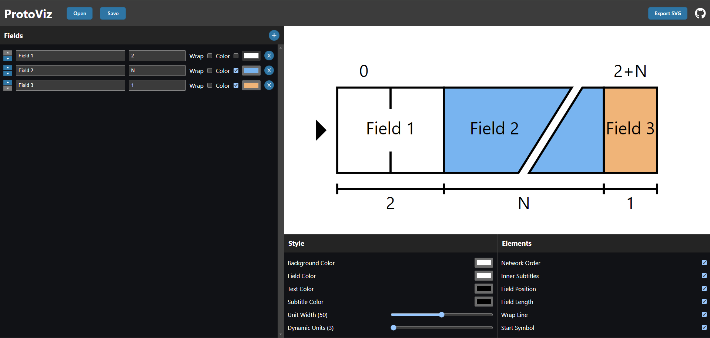
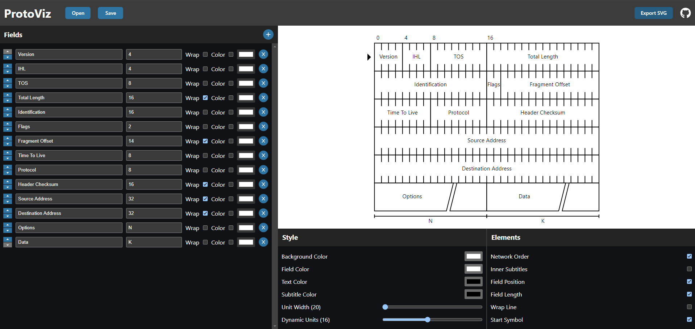

# ProtoViz Website

Available at: https://protoviz.stu.art.br/

A fast and intuitive way of creating figures for protocol documentation
---

*Default Website Homepage*

*IPv4 Packet Frame*

This project is a frontend for the [ProtoViz](https://github.com/danielstuart14/protoviz) library. It runs completely in the browser, with not backend needed.

Made with [Dioxus](https://dioxuslabs.com/).
